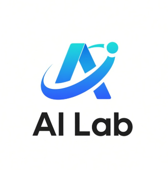

<div align="center">



# WFLA AI Lab Website

### Learn the Intelligence. Build the Possibility.

WFLA AI Lab 2026 校园社团招新网站

[](https://github.com/WFLA-AI-Lab/Website/blob/main/LICENSE)

</div>

## 关于 WFLA AI Lab

WFLA AI Lab 是一个以人工智能应用与实践为核心的学术类社团，面向所有同学开放，不要求计算机或编程基础。

我们关注人工智能、大语言模型、深度学习与智能体，希望每位成员都能在轻松的氛围中学到知识、参与项目，并把想法变成真正可以展示和使用的作品。

## 活动方向

### AI 工具教学与项目开发

- 学习检索、写作、设计、演示和内容创作等实用 AI 工作流
- 根据成员真实的校园与学习需求设计活动内容
- 协作开发并上线一个公开的 AI 工具学习网站

### Minecraft × AI

- 以《我的世界》为载体学习 AI 开发基础
- 训练 AI 完成移动、巡逻和游戏任务
- 探索多 Agent 协作、互动玩法和视频内容创作

## 网站特色

- Canvas 粒子网络与指针交互动效
- 社团简介、活动主线与学期路线图
- 桌面端、平板和手机响应式布局
- GitHub、邮箱和微信联系方式
- 纯静态 HTML / CSS / JavaScript，无构建依赖
- 支持 GitHub Pages 自动部署

## 项目结构

```text
Website/
├─ .github/
│  └─ workflows/
│     └─ deploy-pages.yml
├─ assets/
│  └─ ai-lab-logo.png
├─ .nojekyll
├─ index.html
├─ script.js
├─ site.webmanifest
├─ styles.css
└─ README.md
```

## 联系我们

- GitHub：[WFLA-AI-Lab](https://github.com/WFLA-AI-Lab)
- Email：[wflaailab@outlook.com](mailto:wflaailab@outlook.com)
- 社长微信：`ricykang402`

## License

项目许可信息请点击顶部的 **View License** 按钮，或直接[查看 LICENSE](https://github.com/WFLA-AI-Lab/Website/blob/main/LICENSE)。
